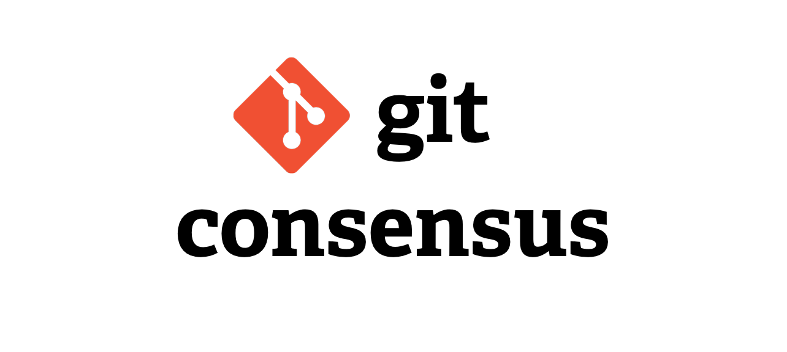

&nbsp;

# [Contracts](#contracts)

Git Consensus enables distributed governance for Git projects. This repository serves as the location for the Solidity contract interfaces and implementations.

&nbsp;

## [Links](#links)

### ⚙️ [Repository Setup](./CONTRIBUTING.md#setup)

### 👩‍💻 [Developer Guide](./CONTRIBUTING.md)

### 📖 [Docs](https://git-consensus.github.io/docs/)

### 💡 [Motivation](https://git-consensus.github.io/docs/motivation/)

### ❓ [Questions](https://git-consensus.github.io/docs/questions/)

&nbsp;

## [Deployments](#deployments)

All contract addresses for each network are stored in [deployments.json](./deployments.json).

&nbsp;

## [Contribute](#contribute)

Git Consensus Contracts exists thanks to its contributors, and more contributors are always welcome. For ways to participate, check out the current [issues](https://github.com/git-consensus/contracts/issues) or make a pull request with your suggested improvements.

To get started with development, check out the [Developer Guide](./CONTRIBUTING.md)!

&nbsp;

## [License](#license)

The code in this project is licensed under the [GNU General Public License v3](https://gist.github.com/kn9ts/cbe95340d29fc1aaeaa5dd5c059d2e60).
