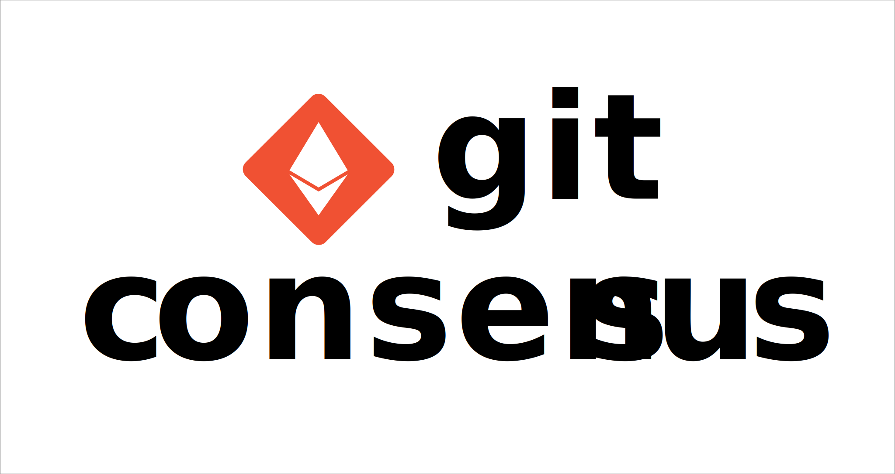

# Git Consensus Contracts

The Git Consensus Protocol enables distributed governance for Git projects. This repository serves as the location for the Solidity contract interfaces and implementations.

&nbsp;

## Links

### 💡 [Motivation](https://github.com/git-consensus/docs)

### 📖 [Docs](https://github.com/git-consensus/docs)

### ❓ [Questions](https://github.com/git-consensus/docs/blob/master/FAQ.md)

&nbsp;

## Developer Guide

This is a modern Ethereum contract repository for Solidity contracts. It combines two extremely powerful frameworks:

- Foundry - for Unit testing written in Solidity ([contracts/test/](./contracts/test/))
- Hardhat - for Integration testing written in Typescript ([integration/](./integration/))

These also offer some great tools for some advanced things like contract debugging, deployment, gas measurements, etc.

## Setup

Clone the repository:

```sh
git clone https://github.com/git-consensus/contract.git && cd contracts
```

Install [Node.js / NPM](https://docs.npmjs.com/downloading-and-installing-node-js-and-npm):

```sh
npm install --global npm
```

Install [Yarn](https://classic.yarnpkg.com/en/):

```sh
npm install --global yarn
```

Install [Nodegit](https://github.com/nodegit/nodegit) dependencies:

```sh
apt-get install -y python2 python3 libkrb5-dev gcc openssl libssh2-1-dev libcurl4-openssl-dev g++ make
```

Install Node dependencies ([node_modules/](./node_modules/)):

```sh
yarn install
```

### Foundry

First run the command below to get `foundryup`, the Foundry toolchain installer:

```sh
curl -L https://foundry.paradigm.xyz | bash
```

Then, in a new terminal session or after reloading your `PATH`, run it to get
the latest `forge` and `cast` binaries:

```sh
foundryup
```

Advanced ways to use `foundryup`, and other documentation, can be found in the [foundryup package](./foundryup/README.md).
Foundry is a blazing fast, portable and modular toolkit for Ethereum application development. It consists of:

- **Forge**: Library for Unit / Fuzz testing written in Solidity (see [contracts/test/](./contracts/test/)).
- **Cast**: Library for interacting with a live Ethereum JSON-RPC compatible node, or for parsing data. A swiss army knife for interacting with EVM smart contracts, sending transactions and getting chain data.

Need help getting started with Foundry? Read the [📖 Foundry Book](https://onbjerg.github.io/foundry-book/)

### Hardhat

Hardhat is an Ethereum development environment for professionals. We use the [Hardhat Network](https://hardhat.org/hardhat-network/) for Integration testing which written in Typescript. It uses Ethers.js and Mocha/Chai. See [integration/](./integration/) for how it's used in Git Consensus.

On [Hardhat's website](https://hardhat.org) you will find:

- [Guides to get started](https://hardhat.org/getting-started/)
- [Hardhat Network](https://hardhat.org/hardhat-network/)
- [Plugin list](https://hardhat.org/plugins/)

### Do Things

Finished [Setup](#setup)?

**Run some [unit tests](<(./contracts/test/)>) with Forge:**

```sh
forge test
```

**Build contract artifacts and run [integration tests](./integration/) with Hardhat:**

```sh
yarn test
```

**Deploy to Ropsten network:**

Create a [.env](./.env) file matching the variables seen in [.env.example](./.env.example)

Getting fully prepared may involve getting a [INFURA_API_KEY](https://infura.io/) by signing up, and getting some test ETH on your target network via a facet.

Then run:

```sh
yarn deploy --network ropsten
```

**Generate contract API docs**:

Ensure `../docs` path exists for [the docs repo](https://github.com/git-consensus/docs). If it *isn't*:

```sh
git clone https://github.com/git-consensus/docs.git ../docs
```

or

```sh
git clone git@github.com:git-consensus/docs.git ../docs
```

Now you can automatically convert NatSpec comments in contracts to docs with:

```sh
yarn doc
```

### Recommended VSCode Extensions

- [Solidity Visual Developer](https://marketplace.visualstudio.com/items?itemName=tintinweb.solidity-visual-auditor)
- [Solidity Language & Themes (only)](https://marketplace.visualstudio.com/items?itemName=tintinweb.vscode-solidity-language)
- [Solidity (by Hardhat authors)](https://marketplace.visualstudio.com/items?itemName=NomicFoundation.hardhat-solidity)
- [Solidity (by Juan Blanco)](https://marketplace.visualstudio.com/items?itemName=JuanBlanco.solidity)
- [ETHover](https://marketplace.visualstudio.com/items?itemName=tintinweb.vscode-ethover)
- [Prettier](https://marketplace.visualstudio.com/items?itemName=SimonSiefke.prettier-vscode)
- [Template String Converter](https://marketplace.visualstudio.com/items?itemName=meganrogge.template-string-converter)
- [TypeScript Import Sorter](https://marketplace.visualstudio.com/items?itemName=mike-co.import-sorter)

### Style Guide

- Add Solidity comments in the [natspec](https://docs.soliditylang.org/en/v0.8.15/natspec-format.html) format.
- Always `yarn pretty` your before committing.
- Lowercase commit message (for consistency).
- Embed your Ethereum address in your commit message on this repository.
- Integration testing with Mocha/Chai asserts: `expect(actual).to.equal(expected)`
- Use [Template Literals where possible](https://ponyfoo.com/articles/template-literals-strictly-better-strings).
- Use same consistent pattern for import ordering.

In general, please do your best to always keep this repository beautiful! ❤️

## Licensing

The code in this project is licensed under the is licensed under the [GNU General Public License v3](https://gist.github.com/kn9ts/cbe95340d29fc1aaeaa5dd5c059d2e60).
